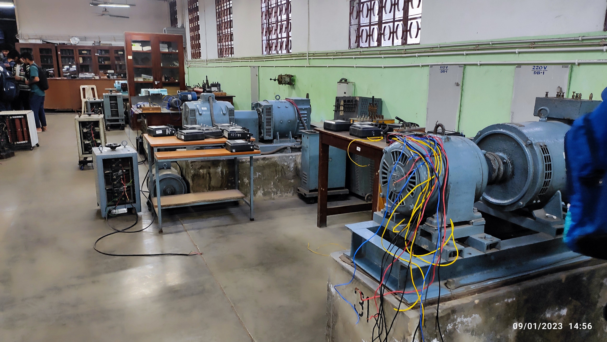
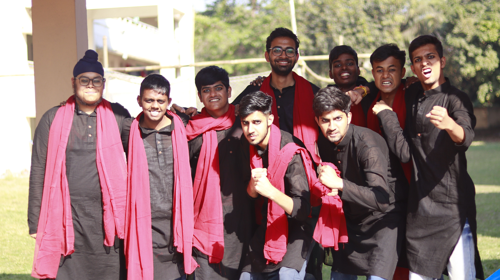

---

Whoo... That was hell-of-a-semester. I mean, if there weren't enough of the academics pissing me off, and Electrical Machines, it surely deserves a special mention. Okay, so let us begin from the beginning.

I arrived at campus 3 days late, so our dear professor taught the entire course of Electrical Technology within those three days, cause, you know, we had it in our First year. So for obvious reasons, I felt I was quite left behind. And all other subjects seemed comparatively easy to me, so I focussed most of my attention on the study of machines. Time passed so quickly that even I could not prepare for any class tests or anything, and I performed poorly in them too. But who was in their senses, after all, it was Kshitij and Spring Fest going on. Oh yeah, I even participated in the Web-a-Thon of KTJ and had a hell lot of fun at SF, but forgetting the part that I had to study for the midsems, and thus, poorly performed in it as well. At least I thought I performed average, but this myth of mine was sure to burst too soon.

As soon as this was over, all that was going on was this high tempo for the General Championship, which unfortunately our hall was banned from, and so we didn't participate in it. But hey, you got no worries, cause the seniors have got a way to keep y'all busy with the Inter Hall Championship. So the teams went to the ground, unprepared, but yeah fought a lot well in it, to our disappointment, we lost in football and cricket, but yes, I was part of the winning team in volleyball. Not to be proud of, but that felt joyous at that moment. In the meantime, I was dodging my 3 labs, and my other acads quite well, and I actually I liked the machines lab so much, even though I sucked at the theory, it deserves mention in this blog.

_Electrical Machines Lab_

And oh, I almost forgot that I was also a part of the Nukkad team of the Patel Hall, which we lost again, but yeah, it was kind of fun, going out late at night to the basketball court and practising for it, singing songs for it, and hoping that we had the best team amongst all halls, until we suffered a whopping 30 points penalty, missing our podium. Surprisingly, this was the only big event under SoCult in which we had participated, so I'll at least be able to tell my juniors that I had participated in such an event.😎

_The Street Play Team_

We had even played a few friendly matches of volleyball, just in case, if we were allowed to play, to be prepared for it. Nevertheless, it was still fun. Then as we moved nearer to the endsems, a huge event was about to happen, and yes, even if you want, you can't escape through it. The Gymkhana elections indeed. Even though I kept myself at bay from the publicity and booze parties (hall days), still I had to keep myself updated about the proposals of the candidates, at least. iykyk. 
And as my hall had two candidates, and both of them won, the happiness of the hall knew no sky. The hall was literally flying high, high and higher. As I stumbled out of it, the parties for our interhall and GC teams were announced. We, who somehow managed to escape out of the election parties, had this great moment waiting for us, and I enjoyed it a lot, actually.

But then I had my endsems so close that I could not even hope that I would somehow manage to get through it. But I went. And I don't know how did I perform, but the time was gone, cause I had CDC in the next two months, and I had not prepared for it, so these two months while I am at my home, I should not rather spend my time writing this blog, but study for it. Or either sleep? Anyways, it's 1AM. I guess it's time to publish the blog now. See yaa.

Signing off,  
Hasta Luego!!
