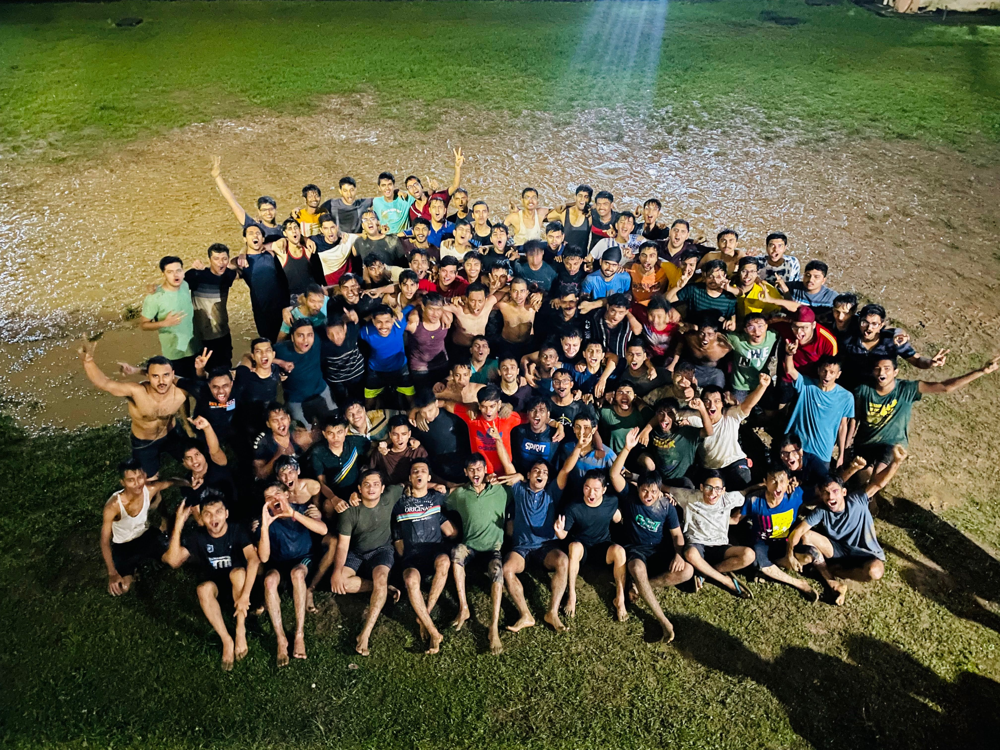

---

Though this blog came very late (almost at the end of my fourth sem), I vividly remember the days when I first came to the campus of KGP. Saddened after leaving my home and my family, the campus seemed very frightening to me. Be it the incessant rainfall, the unbearably humid weather, the tasteful food, the alien language-speaking people around me, and whatnot.  The day my parents left me, the immediate evening I was called to Gymkhana for what were known to be the "Grooming Sessions".

I was given instructions to follow some basic etiquettes, some basic format of my formal introduction, make a diary to note the minutes of meetings, fill the diary with all campus and academic-related stuff, remember them, remember the previous council, and just because we were new to the campus, remember the complete campus. That's all that I could recollect now. So all these had to be completed in the first week itself, cause that's when our classes would get started. So by the time, people were finding it difficult to remember the route to Nalanda complex, we were aware of most of the campus area and the names of every hall, every department, the centres of excellence, their location, hall council, hall moto, etc. What I thought would be my first week of exploring the campus, turned out to be very true.

Classes were not as good as I expected them to be. I later realised that despite you going to classes, you don't understand much unless you study it by yourself. But I didn't study much, apart from when we had 2 weeks left for the exams. Earlier I thought I was having trouble understanding the accent of their language, but later it turned out I had a problem understanding the subject itself. The myth that engineer's college life is fun and easy busted very early when I had my first class test, which literally thrashed me to the ground. (guess the subject? Analog electronics) Life was not going as smoothly as I expected it to be, with the sleepless Friday nights I spent in the ESR room and the sleepy lectures at the air-conditioned Vikramshila complex to the daunting 10 days of the much-appreciated Assimilation Programme.

Those 10 days were completely new and probably the most unique days in my third sem. Those were the days when we learnt the actual etiquettes, actual bonding, and the true meaning of what was known to be the hall tempo. I'll not go into this very subjective matter of whether hall tempo is good or bad, but the way the assimilation programme ended, with the dahi handi and a mouthful of rasagullas by our seniors, I don't think it could have ended any better than this.
published

_Final Day of AP_

Soon after the AP, while our tempo for the hall was still raging in the blood, another major, highly sought after (atleast in our second year) event, the Illumination, or Illu, was aboout to come, and due to AP and stuff, we were left only around with 15 days. While other halls started preparation months earlier, we knew we were lagging behind, but we didn't compete for being the best illu of the year, but rather, as we were told, bonding🙃. Anyways, the day was extremely painful for me atleast, after all those sleepless nights we spent, we were unable to light it on Diwali, and I felt so broken that day...
published

_Illu Nights_

Thought this picture during those days would cheer up my mood today. Atleast I had some good memory of it to look back at.😇

Signing off,  

Hasta Luego!!
