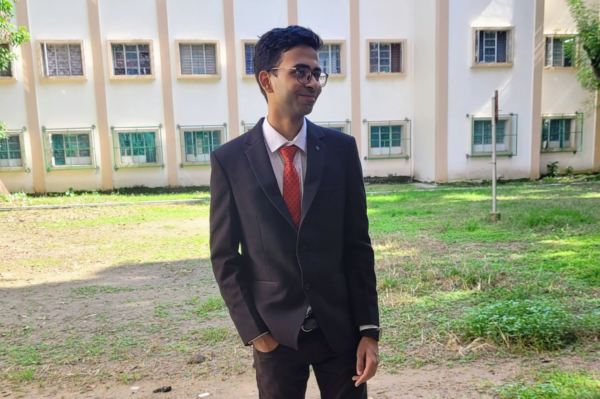

---

The spring semester of 2023 ended around April end. The next big target ahead was the summer internship tests which began in July itself. I had around 2.5 - 3 months for the preparation. All I did during my college time was web development. Now, the complete focus had to be shifted towards DSA and competitive programming. Will the two months suffice?

The day I reached home, I planned to begin studying from Day 1. But as we all know, who the hell studies straight away after reaching home? I indulged myself in the comforts of long hours of sleep and delicacies served right on my plate before me. However, the time was limited, and so I began to practice contests and watch videos of CP and DSA. The more I studied the more I realised that it would have been better if I started early. Nevertheless, I kept practising. There were a lot of times I felt burned out. I didn't open my laptop for a few days of the week. I was just fed up with it. But still, I pushed myself to study for at least a few hours of the day, not much though, to complete till dp and graphs.

Then the most demotivating thing that came to my notice was that my rating on CP platforms did not rise as steadily and steeply as I expected it to be. Or as some Machau Seniors told me, "2 months mein 1600 tak aaram se pahuch jayegi CF par rating". But what I didn't know was they had already completed most of the DSA in their college days, and all they had to do was practice CP. Late realization of mistakes kind of felt hard to me, making me more tense than before. Nonetheless, I kept practising till I had completed till graphs.

Everyone felt the heat of the CDC when the CV building portal was opened. 4 complete days were spent on the CV-building task. Later, when I asked for reviews, the reviews weren't so good. Even I knew that my CV was sub-par. But there was no time to flaunt my elementary skills on my resume to increase its score on ATS portals. The time was not good for me, when I asked a senior about how I was feeling and what should I do then, he asked me to forget about interns and focus on placement. This was the time I knew that I needed a lot of luck to grab an intern. The initial companies that opened their application were mainly quant, software and HFTs, all of them seeming to be impossible to crack. But even though I applied.

I arrived on campus on the 15th of July, almost half a month earlier than we were supposed to be. I thought maybe some help would be provided by others to crack the coding rounds at least. But it didn't help much. Even though I solved some of the coding tests completely by myself, the chances of getting a shortlist were not much. Some tests went good, some bad. Even though no shortlist. Day 1 was announced, and so was Day 2. Most of the people whom no one was expecting to get an internship were sorted on Day 1 and Day 2. It felt as if I lost the opportunity. But one good thing happened, and that was the tests were conducted offline. Even though some people managed to cheat anyway, the scale of cheating was very diminished. And there I saw a chance to do well.

> ##### Hope. If you have it, you have everything.

My first shortlist was on Day 3, for Cohesity, a company known only to hire CSE students. A total of 6 candidates were shortlisted, of which all were from CSE and I was alone from Electrical. I knew that it would be a tough call for me, but somehow I was able to reach the final round of the interview. A total of 4 candidates were able to reach the final interview round. Knowing that the company prefers CSE students, I didn't have hopes for it. And sure, all 3 other students were selected, except me. First rejection.

My second shortlist was on Day 4, for SLB. None of us knew what was the hiring trend for it. Anyways, 40 students were shortlisted for the interviews. Round 1 Group Discussion. Cleared it in the first slot itself. Next Technical Round 1. Cleared it. Next Technical Round 2. I was the first to be called for the round. Cleared it very well. I knew that I had done really well and would be the first to be called for the HR Round. Called for the HR round. I don't know why but it lasted for 40 mins. Usually, it doesn't go that way. I knew either I fucked up or there was something wrong. When I told my friends I had reached the HR round, everyone thought I made it. But then the final shortlist came, it had only 2 students selected, out of 40. A total of 6 students were selected for the HR Round, but only 2 were able to clear it. Second HUGE rejection.

My next shortlists were for Day 6 companies, Bidgley and Visa. I knew that this was the last chance I'd ever get to secure an internship. So, I went for the interviews. The first was for Bidgley. The round was really tough and I thought I would not clear it. Before the results were announced, I went to interview for Visa. The round went good. But when I reached to know if I was selected for round 2 for Bidgley, I wasn't. Third Rejection. I thought it was all wrapped. I reached the hall and was not hoping for anything from Visa. But suddenly, I got a message that I was selected! Visa had a total of 8 shortlisted for interviews and selected 3 students.

Maybe having faith in God and myself paid off. Or maybe luck favoured me that day. The only thing that I gained to know was that, behind very hard work, one needs a tinge of luck to be successful. Thankful to God, my family, my friends and all the well-wishers who helped me reach here today ✨✨.
Hope for the best, expect the worst, and take what it comes.

_Moments before rejection_

If you need a detailed article about how the questions were during the Visa round, check my article [here](https://www.geeksforgeeks.org/visa-interview-experience-for-software-developer-on-campus/).
