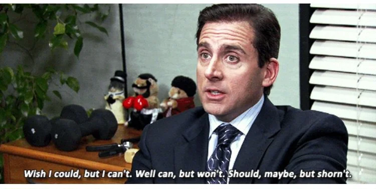
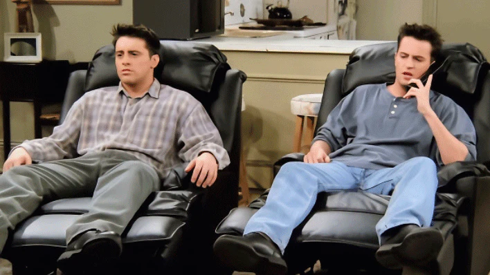

---

I dived into sitcoms in my first year (No wonder it was an online semester) and obviously, I began to watch Friends, partly because the show had the feel of the 90s New York, and I hardly think of anybody who didn't like that period. But now as I connect the dots, I begin to see that path again, wishing that I could start over again.

The soothing apartment of Monica's in Friends in the urban area of Manhattan, with the hilarious group of friends living right across the hallway seems like a dream to me. Maybe because I always wished I had the same life as them, having Thanksgiving together, hanging at the coffee house, and simultaneously being involved and tangled in everyone's life beautifully. Though not completely realistic, but still seems good to imagine myself in such a place in the near future🤞. Some wholesome moments in the show still make it worth watching again and again, and I guess that's the reason the show is the most-watched show year after year. Wish I could have my bachelor's life spent the same way they did...😇

Then later I thought 'Ab Friends dekh hi li hai, why not watch The Big Bang Theory'. In this way, I watched The Big Bang Theory, just a bunch of nerds and their nerdy stuff all around. Seemingly finding their way in the much-rough world for them, it humours around their quite timid nature and the desperate urge to find a girl for themselves. Anyway, the show had some references to the Star Wars and Star Trek movies, which I watched, too, but later. Even if I didn't like the show much (relatively) it got me some really good movies which I think I might never have explored.

Now I had to make a choice between Brooklyn Nine-Nine and The Office (shifting from 1990s to 2000s to 2010s). Gladly I chose The Office, and I must say, this show is the funniest among all of them. The kind of not-so-appropriate humour in the show along with Michael Scott's weird acts make it a huge hit for me. Throw me some food and a laptop and I will surely watch Office again. Though many of them say that the quality had dropped after S7 (couldn't agree more), they somehow managed to give it a pretty good end. For many of the non-viewers of a sitcom, it's not the duration of the show, but the end of it that makes it a hit or a flop sitcom.

Why do I watch them again if I've watched them again? I don't know. Maybe it's the momentary relief of experiencing their way of life, or maybe I'm just trying to escape the reality of KGP by reminiscing the moments around me while I was watching them for the first time. Some even say that we experience comfort in watching things that we lack in real life. But I don't think that is a reason. Whatever it is, I wish I could watch sitcoms less, but...

<!-- 
_Detective Michael Scarn from Threat Level Midnight_ -->


P.S.: I started watching HIMYM, and till now, it feels good. Though I've heard it doesn't have a good ending, still I'll watch it. It's the newness, the excitement of the first watch of the series that motivates me for it. Should find a comfortable place to watch it, perhaps something like...
published

<!-- 
_The One Where Ross and Rachel... You know..._ -->


Signing off,
Hasta Luego!!
