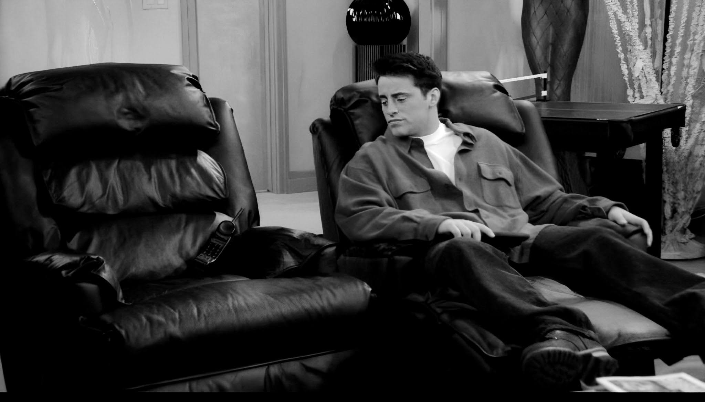

---

On the 29th of October, 2023, one of my favourite actors, Matthew Perry passed away. Just 2 days after I had published my blog about my love for sitcoms. I still remember feeling all gloomy that day. My Instagram feed was filled with his funny quick-witted comments, and it made me sadder even more. Leaving behind a mystery of unanswered questions and the unspoken dark reality of the people around us. Baffling me made me think about what we THINK we achieve, and what we are made to leave behind. Call it your legacy, memories, or the pain you inflicted upon others, knowingly or unknowingly, either oceans of fortunes or mountains of debts.

_No Caption Needed_

Unfortunately, we all are a part of the pain we inflict upon others. It seems vague but the kind of impact we have over someone cannot be known beforehand. Even some minor acts, like denying to participate in something, may cause pain of greater levels. Just like shown in 13 Reasons Why. However hard we try to be good to everyone, we cannot please everyone at the same time. Over some time I thought making into this college made my parents proud, and even though I think I achieved that, sometimes I feel it is not enough.

I always find them struggling to hold the tears back as I leave after my holidays. They know, I know yet we all prefer not to speak about it. Neither can I help it, nor they could. Once I stumbled upon a verse in the Bhagwad Gita, which said:

> ##### What all beings consider as day is the night of ignorance for the wise, and what all creatures see as night is the day for the introspective sage.

Maybe I am ignorant. Maybe they are. Whoever it is, I know that we all are performing our duties tirelessly. Hoping that we will all find ourselves in a position where we won't regret ourselves holding the tears back. Let us hope for the best, shouldn't we all?
Things were never meant to be as simple as we imagine them to be. All we can do is either enjoy the moments left in our hands, reminise about those passed. I've read this somewhere:

In one life there is love for one's children to tie to;
In another life, a talent to be used;
In a third, perhaps only lingering memories worth preserving...

Beautiful, isn't it?

Signing off,
Hasta Luego!!
