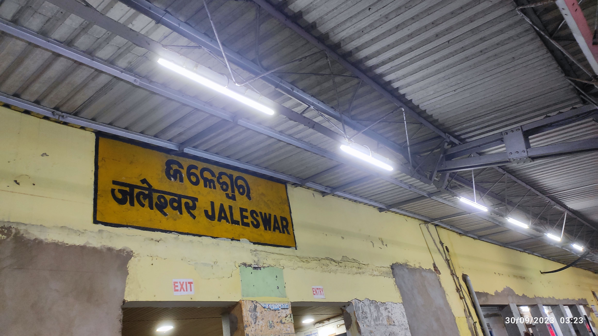

---

I originally thought that this blog didn't have much content to write about, but later I realised that the internship part had also happened this semester and all of a sudden I had all the content needed for it. So, I'll go bit by bit, not completely focused on the intern part as my previous blog.

So actually the pre-prep for this semester began earlier in the summer holidays itself, mainly for the interns. Fast forward to when it was time to reach campus, I remember arriving around 15-20 days earlier. Grinding all day for the OAs, and suffering through conjunctivitis (twice in the same semester), somehow I managed to grab an intern (much of a luck factor played out). But later I realised that during this time, I hadn't prepared for the courses as much as was needed. I think I got an offer just before the midterms. And of course, parties happened too, by some friends who got an offer and just one from me😌. I remember speaking to other friends of mine from my city about their status as well. But anyway, all that happened happened for good and midsems happened too. Not as good as I thought they would be.

Later I finally (after one unsuccessful attempt) planned a trip out with my friends to Puri, for an extended weekend around the end of September. But it never goes as planned. Thanks to our empty stomachs and the other hungry fellows, I and my friend missed our train to Puri at an intermediate station (nobody would've heard of it, and neither did we) Jaleswar. Scenes of flashback still haunt us sometimes, though we pass it off as some joke. But only we knew how we spent the night at the station desperately waiting for the next train. The slow-paced local train was in contrast to the high-speed air-conditioned train that we missed. We even thought of the movie Jab We Met, to get a taxi to the next station and catch the train. But thanks to the remote station we were left at, all we could see was stray dogs, and cows all over the station. Even Kharagpur felt better than it. We spent some 3 hours over the bench and at 4 AM, we began our tedious 7-hour train journey. Thanks to the delicious US Pizza (again, never heard of it) and the complementary brownie, it made the tedious train journey look miniscule.

_Jaleswar Railway Station at 3:23AM_

Then upon reaching Bhubaneshwar, we made our signature move. Having around 2-3 hours of sleep at Puri, because we needed to be at Jagannath Temple at 4 AM, we had a heavy meal at lunch and shamelessly slept for 4-5 hours in the afternoon, which seems foolish now but was justified then. Signature because we did the same in Kolkata as well. Then the usual stuff, go to the mall, watch some movie or something, and return to the campus. I usually need to look into my photos to remember the moments, but the trip always seems like yesterday. Most of the moments in the trip still crack us up.

Returning to campus was just the beginning of the Durga Puja, which meant another week of holidays. It didn't mean that we studied during that period, I rather watched True Detective, How I Met Your Mother and some other series. Ohh, and I always thought that I was living in KGP yet never seen a snake around, this belief of mine was broken soon by its surprise visit right near our doorsteps. With more than half of the wing vacant, the snake quietly crawled and got stuck under the door of my friend's room. It was rescued. What? My friend? Yes, he was fine, but his face after the incident still gives me a hard laugh always.

With the daunting end-semesters approaching, the campus was confused about whether Illumination should be made. But if The Force forces you, even if you don't want it to happen, you are made to. This time we didn't do any heavy lifting, just the perks of being a senior. Even though we could proudly say that this time the Illumination was lit up and we all were somewhat relieved, that it didn't go like our time, Times passed, endsems happened. No comments on my grades. Let's just say that I learned more about how the time I spent is not quantifiable with the grades 😇.

Hmm, I never write this summary of the semester when I'm at home. Just wasting other precious hours of my semester on such stuff, rather than doing something productive. I hope I enjoy these pieces when I read them afterwards.

Singing Off,  
Hasta Luego!!
