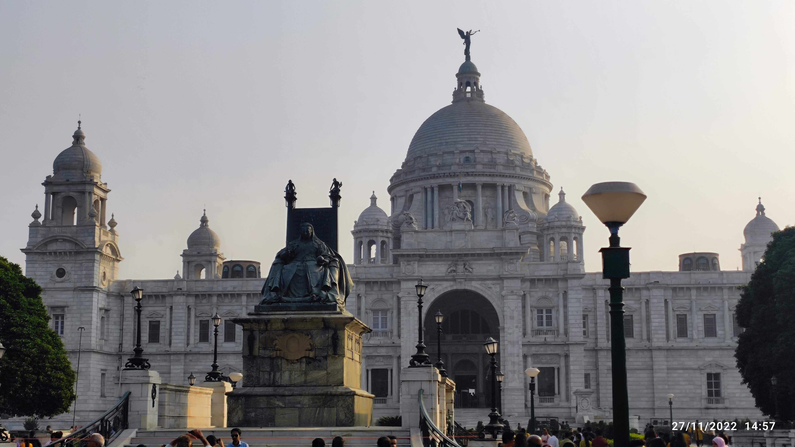

---

Even though I had been to Kolkata (while I went to my college 🙃), I didn't get a chance to explore it. Partly because I was rushing to reach Kharagpur early, and partly due to the monsoon. It doesn't rain this much in my city as compared to WB. Anyway, after a long and detailed discussion with my friends, we decided to plan a two-day stay in Kolkata. Finally!

##### Day 1

Got a local train at around 10 am on Saturday. Reached Kolkata at 2 pm. Taxi to the hotel (guesthouse). Guesthouse because one of my friends had his dad working in the I-T department, so why not have a stay there? It was when we ordered food online, had it while sitting in the ultra-chill-cooled room and slept off for about 4 hrs straight. Wasted a lot of time there. Woke up and went wandering in the streets. Hungry and tired after a long sleep, we found a small outlet of CCD. On seeing the bill, I realised why the subsidised coffee on campus tastes better. After roaming for about an hour or so, we went to a mall, had our dinner and watched a movie over there. I don't remember exactly which...

Then comes the best part. As we returned to the room back, we bought some huge cold drinks and snacks along the way. Moved the beds into the living room, turned the AC on, lights off and a movie on the TV. Hereditary it was! (don't know why I remember that 😂)

##### Day 2

We woke around 11 that day. Had breakfast (not brunch), skipped lunch, and again had a long discussion about where to visit. We (unanimously) decided to skip some park or similar kind of place and visit what was mandatory to be visited, Victoria Memorial. For some reason, we decided to view the parks and not the museum there. So we wandered around for about 2hrs or so, doing nothing but taking endless pictures of the white monument and mocking ourselves for some dorky things we did. 
published

_Colonialism at its prime_

We then went to see a famous cathedral very close to the memorial. Honestly, I've seen better ones before. Then we decided to move towards some nice area of Kolkata, and my favourite, Park Street. It has nothing special as such. But when people like us who are fond of expensive cafes with limited money discover such a place, we indulge ourselves. So, we spent almost an hour at the Barista sipping the coffee and planning for the night. Clubbing was way out of the league, so we decided to stick to the basics, grab some snacks along the way, and watch some movies in our room.

##### Day 3

Packed our bags and back to campus🤓.
Though we didn't visit a lot of places and neither did we "explore" the local culture of Kolkata, it made me filter my group of friends into a smaller circle. Not to forget the Barista cafe at Park Street which we never miss visiting while we are at Kolkata. 
Never let a good coffee go to waste

Signing off,
Hasta Luego!!
