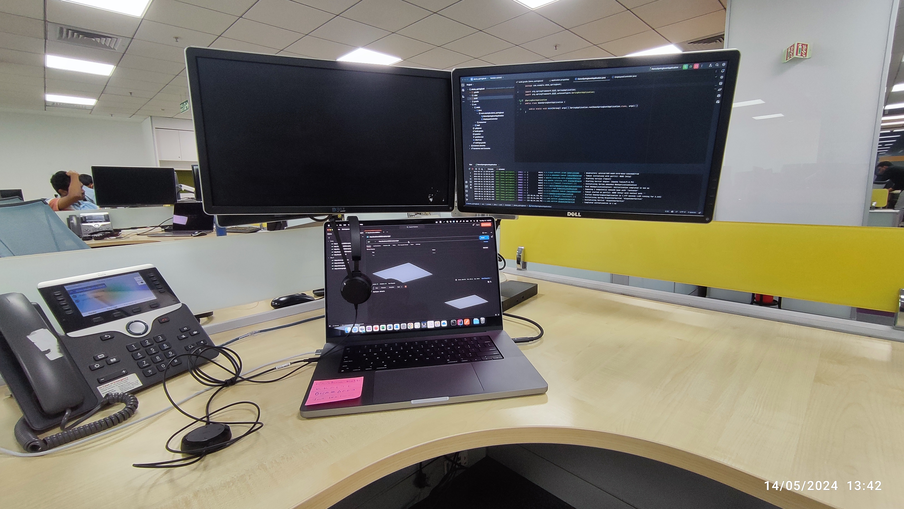

---

Well, after a long time, I am finally back to write something over this page. I wondered if anyone, including me, would ever read these blogs again. But since I'm bored at midnight, I'm letting it flow. I think maybe start with some positive things about it.

First time in Bangalore, I found my PG, blah blah blah... and I was at the office. I found the place good (maybe because of the air-conditioned floors), enjoyed the meals I got there, the cafeteria, all in all, a good place to work. I was always almost right on track to finish the intern project, yet I always found a LOT of time to just roam around the office. 10 weeks seemed a pretty long time to spend here. Got assigned to a wonderful team to work with, made some friends (sceptical) with the other interns and had a great laptop to work on.

Fine. But I always knew that this was just the mere excitement of working at a new place. It would fade away, and oh, it surely did. After a few days or so, since I had already explored the entire office even before others had done, all that was left was work! But it never felt like I had some daunting task to complete, I knew what had to be done, and the only thing new to me was the tech stack. Sure thing, you can always get around the technical stuff faster, what I felt more daunting were some facts that hit me harder while I was in Bangalore.

I had around 10 weeks of internship to complete, and within those days, I managed to get 4-5 days to work from home. And while I was home, all I could see were the days left before I had to return. It never felt like being at home, you know, long were the days gone when I was at home. Now, I was just a mere traveller travelling around, making a brief stop at some place, reminiscing about the sweet memories I had there, and again moving to someplace else. I feel sad when I think about it this way. But if travelling is my destiny, then travel shall I. When the paycheck hits your account, giving you some kind of financial independence, many perspectives happen to change. I know the people, I know the place, and I feel happy while I am there, yet something changed, I would never feel the same feeling ever again. Maybe its just growing up! 👀

> ##### The lonesomest thing in all the world is a soul when it is making ready to go on its mysterious, far journey.   
> ###### ~The Last Leaf by O. Henry

Loneliness hit me the most at Bangalore, not just because I had no friends over there, but also due to the hostel culture I've been experiencing at KGP. However good my PG was, I was well-suited to live in more pathetic conditions than that. The only part I was missing was a good group of people to talk to. Bang into any other room, smash open their door and have a long talk over some random stuff, yet never feel deprived of topics to talk about. I could not obviously tell my parents about how lonely I was feeling, or else they would've called me back home to spend some time with them. Not that I don't enjoy it, but it doesn't make sense to spend a lot of money going back and forth only to return back at the same place. At that time I realized that is what the corporate circle of loneliness feels like. I rather have a good time while I was in the office than spend it alone at the PG. But still, I had some good moments spent there alone, especially at the terrace alone at 3'o clock in night.

_My Workstation :)_

Maybe things would change when more of my folks will be at Bangalore for their jobs. For the sole reason, I tried to perform well in the internship to get a full-time offer. Because I need something to do so I don't go to bed on an empty stomach at night.💀!!

*P.S.*: I received a full-time offer from Visa and I gladly accepted it :)
