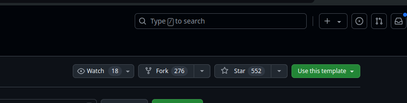
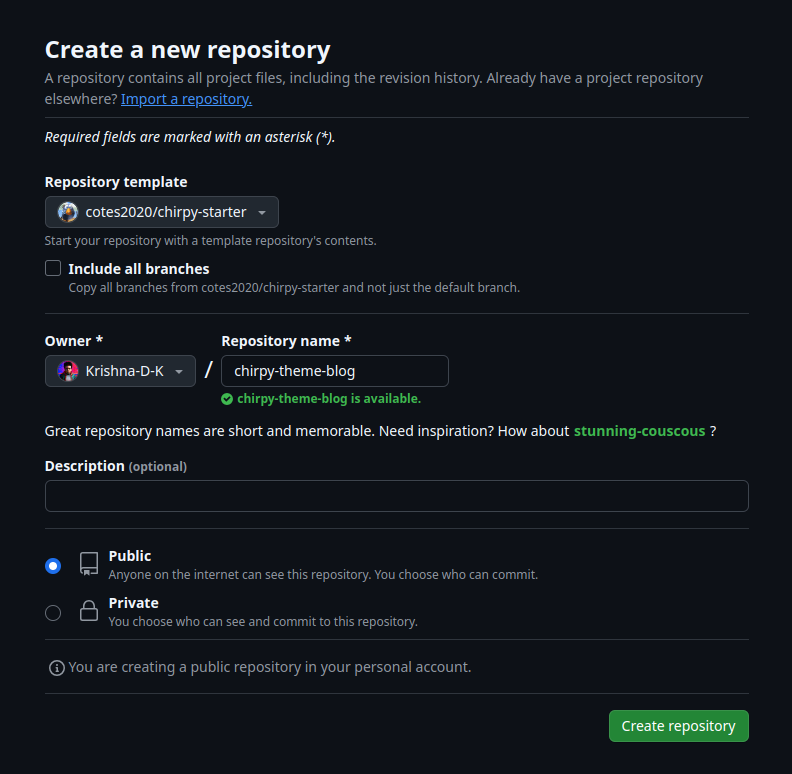

Just when I was about to get started to write , I realized that most often I write in the same date pattern. Hmm...

---

Anyways, let's get started into this kind-of-new thing where I'll try to mix some technical blogs into this site, you know, on the lighter note. For some serious articles visit my [Hashnode](https://krishnadk.hashnode.dev) site. Maybe start with how to exactly replicate this blog site.

### Ruby and Jekyll

Ruby is a language. Just like C or Javascript. And Jekyll is a static-site generator written in Ruby. To have a little analogy, consider Jekyll as a package, just like we have in Python and JS. For Ruby, a package is called a gem. So Jekyll is a gem that helps us to create statically generated sites within minutes.

### Static-Sites

So normally, when you use a CDN (Content Delivery System), the data (say blog) is fetched from a different server rather than the same server that presents you the web page. Which isn't a bad choice. That is what I used earlier to design this site. But since I'm not so good at UI, and also considering the benefits of static-sites, I chose this. Static sites automatically create an HTML page for you beforehand, so that you can bypass the CDN route. And since I was more likely to write a blog that didn't actually need a CDN for, I chose this.

### Why Jekyll?

Ready-made, responsive themes are available as templates to use. Modify it a little and you are good to go!

### Building it actually

Assuming you have [Ruby](https://ruby-lang.org) and [Git](https://git-scm.org) installed in your system and a GitHub account, let's make a copy of [this](https://github.com/cotes2020/chirpy-starter) Chirpy theme template  from GitHub. Just visit this site and select **Use this template** option.


_choose the option Use This template_


Create a new repository and the entire content will be copied to the repository for your use!



_create a new repository_

### Setting the local development server

Just copy the address of your newly created repository and head to the terminal.

```zsh
mkdir chirpy-blog
cd chirpy-blog
git clone <YOUR_COPIED_URL_ADDRESS>
cd chirpy-starter
```

After you are done with the clone and moved to the directory, just run the commands (Hoping that bundler must be installed in your system. If not just run `sudo gem install bundler`)

```zsh
bundle install
bundle exec jekyll serve
```

And if everything proceeds correctly (fingers crossed 🤞🤞), you may see the message that server running correctly on port 4000!

Move to your browser and go over localhost:4000 to see the site running.

> ###### Note: If you accidently encounter any dependency issues (I did), it mostly would be because of wrong ruby version used. Instead use [rvm](https://rvm.io/rvm/install) and use the specific version using `rvm install <VERSION_NUMBER>`

### Writing a new blog post

Simple! See the folder name `_posts` inside the chirpy-starter folder? Create a new file named in the following covention:

**YYYY-MM-DD-Title-for-your-blog.md**

Once created, move to the file and copy the following content into it.

```md
---
title: hello world!
author: Papa Jones
categories: [CATEGORY, SUB_CATEGORY]
description: My first blog post!
comments: false
pin: true
image: <RELATIVE_PATH_FROM_ROOT_DIRECTORY>
tags: ['tag1', 'tag2', 'tag3']     # TAG names should always be lowercase
---

# Hello World!

This is my first blog post!
```

Save the file and voila! A new blog post would automatically be created for you!

---
If you have **actually** READ it, and **trying** to really make one, and stuck at someplace, I'm glad to help :)